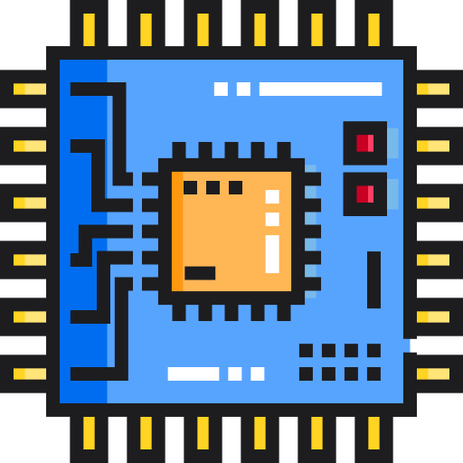
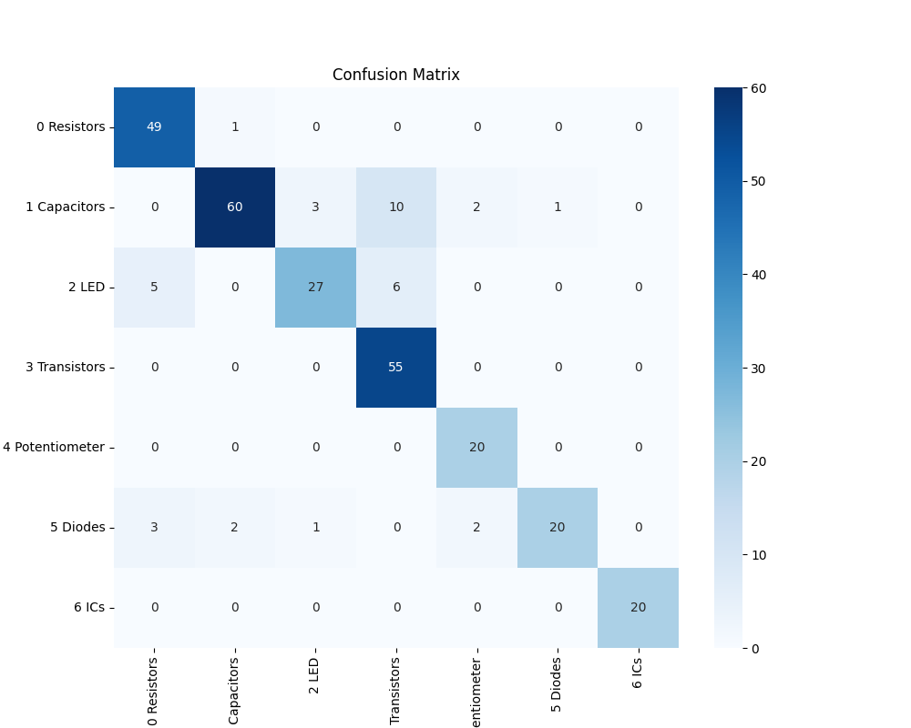
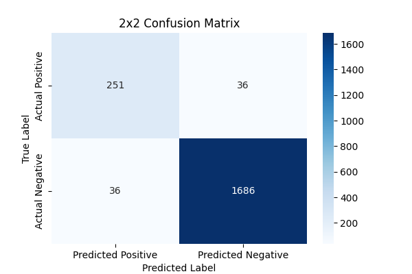
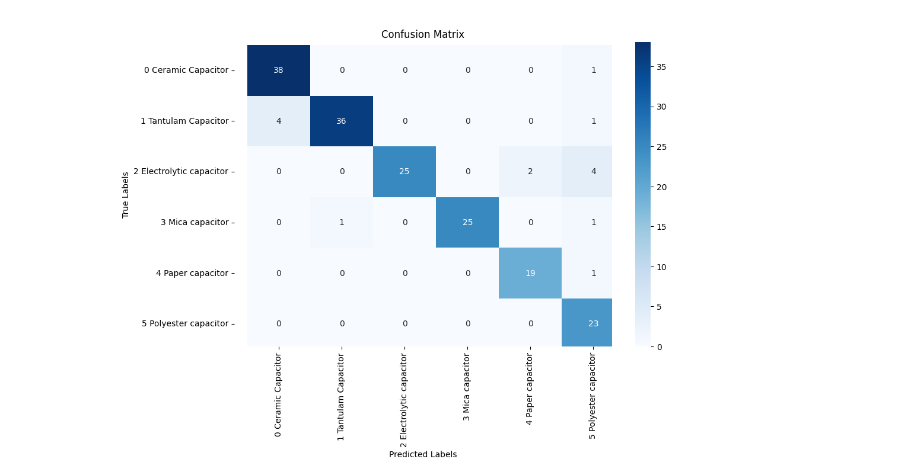
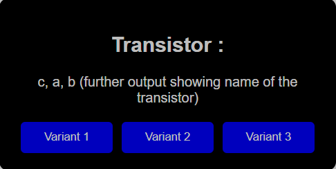

[](https://www.intel.com/) [](https://www.intel.com/) [](https://keras.io/) [](https://flask.palletsprojects.com/en/3.0.x/) [](https://www.python.org/) [](https://www.tensorflow.org/) [](https://opencv.org/)

<h1 align="center">Electronic Component Classifier</h1>

<p align="center">
  
</p>


<p align="center">
  <b>Introducing the AI-Powered Electronic Component Classifier: The Ultimate in Intelligent Component Management.</b>
</p>

## Table of Contents

- [Table of Contents](#table-of-contents)
- [1. Description 📄](#1-description-)
- [2. Features 📝](#2-features-)
- [3. Usage 📒](#3-usage-)
- [Important Points  📝](#important-points--)
- [Video Guide 🎥](#video-guide-)
- [Approach and Implementations 🧑‍💻](#approach-and-implementations-)
  - [Challenges 🤔](#challenges-)
- [Known Issues  💭](#known-issues--)
- [Insights and Applications 💡](#insights-and-applications-)
- [Going Beyond 🚀](#going-beyond-)
- [Links 🌐](#links-)
- [Attributions 💻](#attributions-)
- [Authors 🤓](#authors-)
- [License  🪪](#license-)

## 1. Description 📄

The Electronic Component Classifier is a project that uses machine learning and artificial intelligence to automate the identification and classification of electrical and electronic components. This document serves as a guide for building and operating the classifier.

## 2. Features 📝

1. Component Classification: Resistors, Capacitors, LEDs, Transistors, Potentiometers, Diodes, and Integrated Circuits are the seven classes into which electronic and electrical components can be simply categorised, using multilayer categorization.
2. Further details: With only one click, you may find out more details about Integrated circuits, Transistors, and Capacitors.
3. User-Friendly Design: The interface is simple to use and navigate, thanks to its clear headings, buttons, and text boxes.

## 3. Usage 📒

* Make sure you have python 3.11.4 installed if you are using anaconda refer to the documentation on how you can use virtual environments to create virtual environments with specific version of python [Anaconda Managing environments](https://conda.io/projects/conda/en/latest/user-guide/tasks/manage-environments.html) or you can install the version of python from [python](https://www.python.org/downloads/).
* After downloading the file dont forget to extract the file TRANSISTOR_OCR.rar using [WinRAR](https://www.win-rar.com/start.html?&L=0).
* Change the paths for the models and the labels in the ```img_classf.py```(present under the IMG_CLASFF Folder) file similarly change the paths present in the ```capacitors.py``` (present under the CAPACITOR Folder).
* Open up ```trans.py```(present under the TRANSISTOR_OCR Folder) and change the paths for the ```recognition_model_path``` and the ```detection_model_path```.
* Change the path of the output directory in the ```main.py``` file .
* It is advised to refer to the video for changing paths. [Video Link](#video-guide-🎥)
* For testing purposes if a component is physically not available, then obtaining a clear image of it on your phone and then using that would suffice, but it is advised to use actual component.


Follow the on-screen instructions to navigate through the application.
- **Step 1** Make sure the libraries that are present in the ```requirements.txt``` file are installed then open up a terminal navigate into the directory where this file has been saved run the following command in the terminal  ```python app.py``` after following instructions in [Usage](#3-usage-📒)
- **Step 2** A new window will be created where you can see the webcam press ```c``` to capture an image and process it or enter ```q``` to quit.
- **Step 3** An output will be shown indicating what specific component it is.


## Important Points  📝
- Refer to the ```requirements.txt``` file for additional information regarding the required libraries.
- To change the which camera is used in the ```main.py``` file in line ```cap = cv2.VideoCapture(1)``` replace the 1 with any other number. This number correspondds to which camera will be active and will be used to take the images of the components.


## Video Guide 🎥


[](https://youtu.be/35lopIiGYqE)


<i class="fa-brands fa-youtube fa-spin fa-2x"></i> [YouTube Video Link](https://youtu.be/35lopIiGYqE)


## Approach and Implementations 🧑‍💻
1. Problem definition:
- The problem of classification of electronic components from images.
 
2. Data collection and preprocessing:
- Collected a dataset from images of electronic components.
 
3. General classification:
- Used a trained CNN model to initially classify electronic components into 7 categories: resistors, capacitors, LEDs, transistors, potentiometers, diodes and integrated circuits based on visual characteristics.
  i. Model selection and development:
  - A CNN-based approach was chosen using Keras for general classification of electronic components based on their visual characteristics.
  - The dataset was prepared by classifying the images according to the types of electronic components.
  ii. CNN model training:
  - Keras and TensorFlow backend were used to build and evaluate the CNN model.
  - "Teachable Machines" online tool was used to train the CNN model.
 
4. Further details about Transistors, Capacitors and ICs:
- Further details about transistors and ICs was obtained by integrating OpenVINO OCR to extract text from images that had their names or any other text on them.
- For further details of Capacitors, CNN-model was developed and trained to recognize 6 types: ceramic capacitor, tantalum capacitor, electrolytic capacitor, mica capacitor, paper capacitor, polyester capacitor.
 
5. Integration with Flask:
- Integrated the trained model into the Flask web application to create a user-friendly interface, that allows users to capture images real-time and receive predictions across different webpages in a comprehensive order.
- Each webpage contains clearly named buttons which just need to be clicked in order to run the models at backend.
- User should be automatically redirected to the page with output.
 
6. Testing and iteration:
- The integrated system has been extensively tested to ensure functionality, performance and robustness.

### Challenges 🤔
- One more objective that we dedicatedly worked towards, was to accurately distinguish resist colors from images and determine the value of Resistor. We explored several methods for the same. 
- To begin with, we tried Edge detection and color thesholding (OPEN CV). In this, we detect edge of bands and then apply color thresholding to correlate the colors extracted from the image with the standard values ​​of the color codes of the resistors. However, this effort encountered challenges due to inherent differences in color and variations due to image resolution and lighting. 
- We next attempted to refine our approach by introducing color segmentation (K-MEANS Clustering). We segmented the image into independent colors and then we figure out the colors present. It matched known color bands to their corresponding values. The goal was to isolate the four main bands of a resistor and minimise the background noise. Unfortunately, this method was hampered by alignment problems.
- Due to inaccuracies, we investigated the pre-existing models specialized for color detection. We realized that only a limited range of colors can be reliably detected, resulting in many colors being missed.
- Further, we went on with Mask RCNN and color thresholding. The Mask RCNN code we tried out encountered errors which were not rectified even after several attempts,hence we couldn't formulate the weights. The intention was that, after obtaining the mask using mask rcnn, we can apply color thresholding in regions of interest, i.e. resistor bands.
- In the future, we are committed to improving our knowledge, methods, exploring new approaches, advancing our resourcefullness and continuously iterating our methods in order to achieve Resistor Band colour detection and then use those colours to develop the algorithm to determine the values of resistors accurately.

## Known Issues  💭

-  Occasional false classification
    - **Status:** Issue being resolved.
    - **Cause:** 
                - Limitations in camera resolution.
                - Lighting Conditions.
    - **Proposed Solution:**
                - Using a macro camera to clearly capture the details of the component.
                  Few cameras that can be used for this purpose [Intel Realsense](https://www.intelrealsense.com/), [Imaging Source](https://www.theimagingsource.com/en-in/product/industrial/). A camera may be opted upon considering the minimum focus distance and the size of the component.
                - Ensuring proper well lit environment with lights designed for the camera will resolve the lighting condition.

- Overall Accuracy of the model  🎯
  - **Status:** Issue identified
  - **Cause:**  In certain electronic components the component will have the manufacturer's logo embossed in the silicon along with the model name and other info. This interfers with the OCR implementation.
  - **Proposed Solution:** Train the OCR model to identify these logos and ignore them during detection.
   
- Given below are the images for the confusion matrix of the model.
  - Confusion Matrix For General Classifier
   <p align="left"></p>
   <p align="left"></p>
  - Confusion Matrix For Capacitor Classifier
   <p align="left"></p>
   <p align="left"></p>


## Insights and Applications 💡
- In recent times, where technology runs the world as well as our lives, the application of electronics in various aspects and industries is growing rapidly. Electronic and Electrical components are building blocks in this process. They are used in every application, starting from consumer electronics to industrial machinery to education. 
- However, recognising and classifying these parts correctly still remains a hefty task, due to the nature of these components. They are often small, there names are not easily visible or values might not be directly given but have to be calculated as in case of resistors. Especially for beginners and enthusiasts, this might seem like a challenge and may lead to usage of wrong components in wrong application which may prove to be hazardous. The process is still prone to random human error even if experienced personnel is there. 
- It was against this practical necessity that we were motivated to come up with an automated process for electronic component identification, using the most useful and powerful tool available today, AI.
- Our project helps reduce the possible human error during the classification, sorting and usage of these highly sensitive components, by making most of this process automated. This also reduces the amount of time wasted in identification manually and makes the process safer and more reliable.
- Another potential benefit of this project involves helping people with visual disabilities locate, identify and use different electronic components, hence making them more accessible to the visually impaired. Traditional methods of identifying components usually rely on human senses such as vision and touch hence they may pose challenges to individuals living with vision impairment. Nevertheless by integrating such an interface like ours, not only will be beneficial in areas of electrical and electronic application such as labs and industries, but it will also be possible to create a system that allows people with blindness or poor sight identify items such as electronic components accurately by using non-visual methods.


## Going Beyond 🚀
- Implementing individual component value indexing and identification.
  - Overcoming the challenges of code implementation for Resistor value detection is one of our next main objectives.
  - Individual component classification for capacitors, Transistors and IC's have already been implemented.

- Adding more component classes
  - for future applications, we want to keep increasing the number of classes in which our model will classify the components.
  - more types of components for different applications and hence developing different models and training them for these classes is being worked on.


- IntelOPEN Vino RAG implementation for getting datasheets.
  -The usage of electronic components often depends a lot on there Datasheets. Also, for components such as Transistor and IC's, a single component may have many differen implementations, variants and derivatives. 
  Hence , by leveraging RAG(Retrival Augmentation Generation) we can implement a feature which, by taking in the model of the component,can return a list of it's variants, by pressing the button the user can be redirected to a website which provides a datasheet of the specific derivative of the component. 

  


- Auto sorting using IoT.
  - Through the utilization of Internet of Things (IoT) technology, we can implement an automated sorting system capable of identifying individual parts and subsequently sorting them into their respective locations, by this we can track the number and types of components available.
- Expanding to smd based components.
  - Along with this, the project can be extended to focus on the Surface Mount Device (SMD) electronics components. In terms of sorting and identification, SMD components pose a considerable challenge due to their microscopic size. Through implementation of extra classifiying ability we will be able to successfully identify the values of these components. Nevertheless, complication arises as SMD components are typically of uniform outlook, making precise identification more difficult.
  

- Full Web Transition & Mobile App Development
  - The current implementation of the code is completely client based, by migrating the code to a server side directive, integrating database and other web based features will be easier and overall the application will be more elegant.
  - Building a Mobile App is also possible as it will solve a major issue with the current model, The camera present in mobile devices are known to have higher quality leveraging this feature we can use the model anywhere we want without having bulky equipments.  


## Links 🌐
<i class="fa-brands fa-github fa-beat-fade fa-2x"></i> [Github Link](https://github.com/Vanguard-s/Electronic-Component-Sorter)


<i class="fa-brands fa-youtube fa-bounce fa-2x"></i> [YouTube Video Link](https://youtu.be/35lopIiGYqE)


## Attributions 💻
- "Icon made by Freepik from www.flaticon.com"
- [Image used in webpage](https://images2.alphacoders.com/117/1171867.png)

## Authors 🤓

<i class="fa-brands fa-linkedin fa-shake fa-2x"></i>

* [Anmol](https://www.linkedin.com/in/anmolkrish)
* [Harish](https://www.linkedin.com/in/harish-r-8b68a333b?utm_source=share&utm_campaign=share_via&utm_content=profile&utm_medium=android_app)
* [Mauli](https://www.linkedin.com/in/maulir?utm_source=share&utm_campaign=share_via&utm_content=profile&utm_medium=android_app)
* [Aryan](https://www.linkedin.com/in/aryan-jaljith-64283b240?utm_source=share&utm_campaign=share_via&utm_content=profile&utm_medium=android_app)

## License  🪪

This project is licensed under the [MIT License](https://opensource.org/license/mit).


